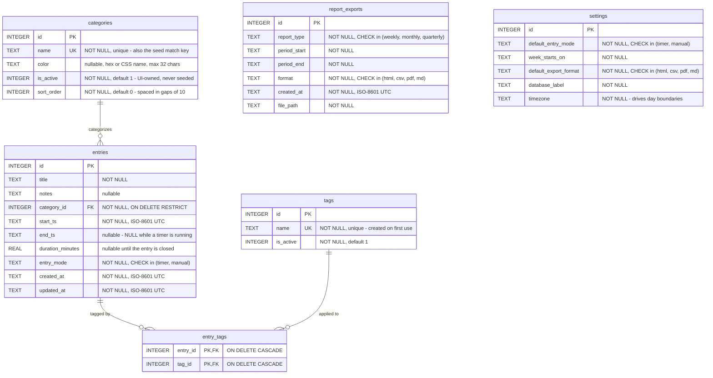

# Time Tracker App

A personal, offline-first time tracker. It runs entirely on `localhost`: a **FastAPI** backend
with **SQLite** as the canonical data store, and a **React** single-page app frontend. There is no
cloud dependency — all data lives in a local SQLite file.

- **Backend:** FastAPI + SQLite (`app/`) — implements `app/API_CONTRACT.md`.
- **Frontend:** React SPA (`frontend/`) — Today, Week, Month, Reports, and Settings screens
  (see `frontend/README.md`).

## Features

- **Time tracking** — log entries against categories and tags; a live timer for the current task.
- **Today / Week / Month** — review tracked time across day, week, and month views; the Week header
  shows the ISO calendar week (`CW 01`–`CW 53`). Entries can be edited inline, including their
  start/end times.
- **Reports** — period summaries (week/month/quarter) with per-category and per-tag breakdowns,
  daily bars, zero-filled weekly bars, a stacked hours-by-category chart, an entry-count line chart,
  and a rule-based narrative summary of the period. Month/quarter bars are labelled by calendar
  week (`CW 27`), with the full date range on hover.
- **Exports** — download your data as an Outlook-friendly HTML report (with bar-chart graphics),
  a Markdown report, a PDF report, a CSV, or a raw SQLite database backup.
- **Settings** — configure timezone (drives day boundaries), week start, default entry mode, and
  default export format.

## Project layout

```
time-tracker-app/
├── app/
│   ├── __init__.py
│   ├── main.py      # FastAPI app, CORS, health check, router wiring
│   ├── config.py    # pydantic-settings configuration (env-driven)
│   ├── api.py       # root API router (feature routers plug in here)
│   ├── db.py        # SQLite connection helper
│   ├── db_schema.py   # SQLite DDL, indexes, idempotent init + migrations
│   ├── dummy_data.py  # generates a disposable, git-ignored sample database
│   ├── schemas.py     # Pydantic request/response models (the HTTP contract)
│   ├── API_CONTRACT.md # endpoint contract (paths, bodies, status codes, error envelope)
│   └── routers/       # categories, tags, entries, timer, today, reports, settings, exports
├── design/
│   ├── DESIGN_SYSTEM.md
│   ├── tokens.css      # CSS custom properties, imported directly by the frontend
│   └── screens.md      # Today/Week/Month/Reports/Settings wireframes + keyboard shortcuts
├── frontend/           # React SPA (Vite + TypeScript) — see frontend/README.md
├── tests/
├── pyproject.toml
└── uv.lock
```

## Database

SQLite, six tables. The diagram below is a **Mermaid** `erDiagram` embedded directly in this file —
GitHub renders it natively, so there is no image to regenerate and keep in sync, and the diff of a
schema change is readable in review. The canonical DDL lives in `app/db_schema.py`; this is a view
of it, so update both together.



`report_exports` and `settings` stand alone — neither has a foreign key. `settings` holds exactly
one row, seeded on first bootstrap by `init_db`.

**Conventions worth knowing before writing queries:**

- **Timestamps are ISO-8601 TEXT in UTC** (`2026-07-13T14:30:00+00:00`). They sort
  lexicographically the same as chronologically and survive CSV/JSON round-trips. Callers
  normalize to UTC on write and localize on display using `settings.timezone`.
- **Booleans are `INTEGER` 0/1** — SQLite has no boolean type.
- **Enum-like columns use `CHECK` constraints**, not lookup tables: the value sets are small,
  fixed, and app-defined rather than user-editable.
- **Foreign keys are enforced**, but only because every connection sets `PRAGMA foreign_keys = ON`
  (SQLite defaults it off, per-connection). Ad-hoc `sqlite3` shell sessions do *not* get this for
  free — set it yourself before mutating data.

Indexes beyond the implicit primary keys and `UNIQUE` constraints:

| Index | Column(s) | Serves |
| --- | --- | --- |
| `idx_entries_start_ts` | `entries (start_ts)` | date-range scans — the hottest pattern (Today/Week/Month/Reports) |
| `idx_entries_category_id` | `entries (category_id)` | filtering time by category, and the FK lookup |
| `idx_entry_tags_tag_id` | `entry_tags (tag_id)` | the reverse join: "all entries with tag Y" |

`entry_tags`' primary key `(entry_id, tag_id)` already indexes `entry_id` first, which is why only
the reverse direction needs an explicit index.

## Requirements

- Python 3.11+ and [`uv`](https://docs.astral.sh/uv/) for the backend.
- Node.js + npm for the frontend (see `frontend/README.md`).

## Getting started

This app has two halves that both need to be running for the SPA to work end-to-end:

**1. Backend** — install deps and start the API server:

```bash
uv sync
uv run uvicorn app.main:app --reload
```

The API will be available at `http://127.0.0.1:8000`, with a health check at
`http://127.0.0.1:8000/health`.

**2. Frontend** — in a second terminal, from `frontend/`:

```bash
cd frontend
npm install
npm run dev
```

The SPA will be available at `http://localhost:5173` (Vite's default) and proxies `/api/*` calls
to the backend above — see `frontend/README.md` for the proxy/origin config and full details.

## Development

```bash
uv run ruff check .      # lint
uv run ruff format .     # format
uv run mypy app          # type-check
uv run pytest -q         # run tests
```

### Dummy database for experiments

The automated tests already isolate themselves (each one gets a fresh SQLite file in `tmp_path`).
Poking at the app *by hand* does not: curling an endpoint, opening the SPA, or running a script all
hit whatever `TIME_TRACKER_DATABASE_PATH` points at, which by default is your real
`time_tracker.db`. Generate a disposable database and point at that instead:

```bash
uv run python -m app.dummy_data                  # write ./dummy.db with ~4 weeks of sample data
uv run python -m app.dummy_data --days 90        # a quarter, so Reports has something to chew on
uv run python -m app.dummy_data --running-timer  # also leave one entry open, as if a timer were running
uv run python -m app.dummy_data --reset          # delete the file and rebuild from scratch
```

Then run the backend against it:

```bash
TIME_TRACKER_DATABASE_PATH=dummy.db uv run uvicorn app.main:app --reload
```

`dummy.db` is git-ignored — it is regenerated, never committed.

**It will not clobber your real data.** The generated database is branded: its
`settings.database_label` is set to `DUMMY DATA (app.dummy_data)`. Before writing to or deleting an
existing file, the generator reads that label back and refuses unless it matches — so
`--path time_tracker.db` fails with an error rather than overwriting your entries. Anything that is
not a time-tracker database is refused too. The guard is on content, not filename, so renaming a
file cannot defeat it.

Generation is seeded (`--seed`, default `20260713`): the same arguments always produce the same
database, which keeps comparisons and screenshots stable. Categories come from
`seed/categories.toml`, so the dummy data uses your real taxonomy; entries land on weekdays only,
in quarter-hour blocks from 09:00, with 0–2 tags each.

## Configuration

Settings are loaded via `pydantic-settings` from environment variables (prefix
`TIME_TRACKER_`) and, optionally, a local `.env` file (not committed). Key settings include
`database_path` (defaults to `time_tracker.db`) and CORS origins for the future React dev server.
